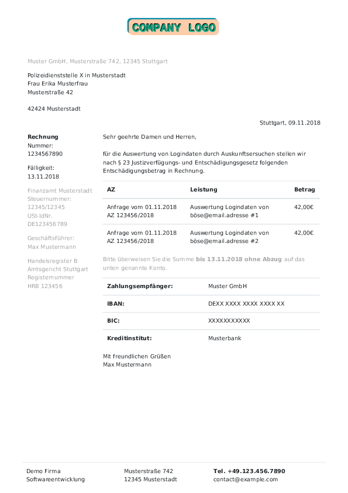
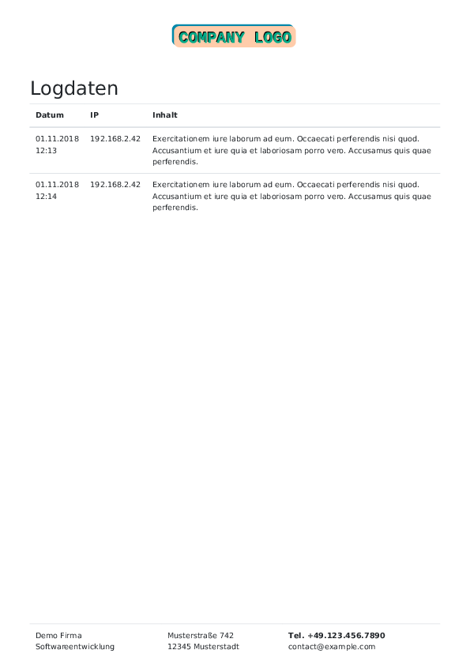
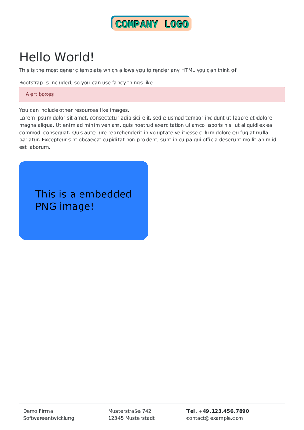

# pdf-renderer-templates

This repository provides a demonstration of templates to be used with the [Aionda LEP](https://github.com/AiondaDotCom/lep) and the Aionda [PDF Renderer](https://github.com/AiondaDotCom/pdf-renderer).
They can be a starting point for creating customized invoices or similar documents.

## Examples

```sh
cd demo/templates/

# Rechnungs Template ohne Header und Footer
curl -F "body-template=@invoice/rechnung.html" -F "body-data=@invoice/rechnung.json" \
     localhost:8081/render > invoice1.pdf && okular invoice1.pdf

# Rechnungs Template mit Header und Footer
curl -F "header-template=@common/header/header.html" -F "header-data=@common/header/header.json" \
     -F "footer-template=@common/footer/footer.html" -F "footer-data=@common/footer/footer.json" \
     -F "img=@common/header/demoLogo.svg" \
     -F "body-template=@invoice/rechnung.html" -F "body-data=@invoice/rechnung.json" \
     localhost:8081/render > invoice2.pdf && okular invoice2.pdf

# Generic Template
curl -F "header-template=@common/header/header.html" -F "header-data=@common/header/header.json" \
     -F "footer-template=@common/footer/footer.html" -F "footer-data=@common/footer/footer.json" \
     -F "img=@common/header/demoLogo.svg" -F "img=@generic/demo.png" \
     -F "body-template=@generic/generic.html" -F "body-data=@generic/generic.json" \
     localhost:8081/render > generic.pdf && okular generic.pdf

# Logdaten Template
curl -F "header-template=@common/header/header.html" -F "header-data=@common/header/header.json" \
     -F "footer-template=@common/footer/footer.html" -F "footer-data=@common/footer/footer.json" \
     -F "img=@common/header/demoLogo.svg" \
     -F "body-template=@logdata/logdaten.html" -F "body-data=@logdata/logdaten.json" \
     localhost:8081/render > logdata.pdf && okular logdata.pdf
```


  
